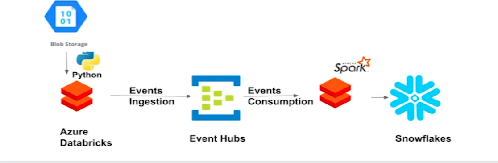

# Databrick_Real_Time_Streaming_with_Event_Hubs_and_Snowflakes

Databrick Project with Azure Event Hubs and Snowflake

# Brief explaination of the Data Architecture for this project.

- An Azure Blob storage is used to receive the source files which is being streamed in the next step.
- A real-time streaming Databricks notebook is going to readfiles from the Azure Blob storage and continuously stream data to the Event Hubs.
- A second Databricks notebook is used to read the ingested records and write the data to Snowflakes table.
- In Snowflakes, we can do long-term storage and analysis.
